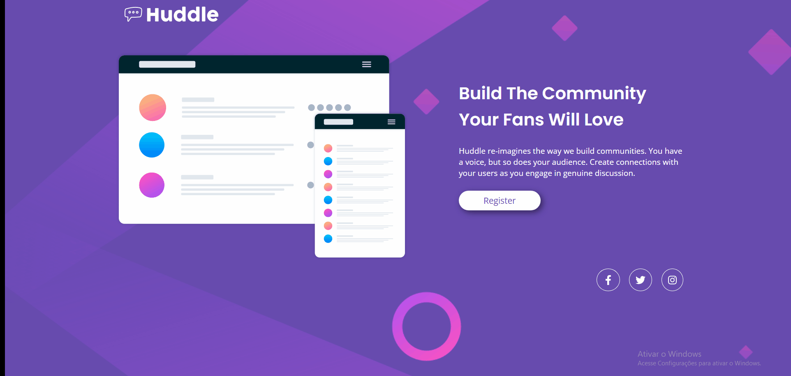

# challenge-html-css-avancado-huddle

 Exercício proposto em forma de quest para teste de conhecimentos ao final do módulo css avançado do curso de desenvolvimento web Devquest. 

Desenvolvi este código sozinha enviei para correção e com base no feedback que recebi de um mentor do curso fiz a refatoração do código. 

## Desafios que senti ao corrigir o código 
Depois de ler pontos que precisava melhorar comecei o processo de corrigir a identação do código, melhorar o posicionamento do container ao centro e também do logo a esqueda, adicionar leve sombreamento ao botão, corrigir o background da versão mobile que estava apresentando repetição e outros detalhes do próprio código, demorei algumas horas para corrigir testando os comandos e posicionar os elementos com as medidas que melhor se encaixava já que não recebi o projeto pelo figma que vem com todos os valores, apenas as imagens que deixei disponível na pasta design o código das cores em rgb e imagens para serem usadas no projeto.

🚀 Fiquei muito feliz com o resultado e sigo estudando para melhorar mais a cada dia! 🚀 

## Tecnologias utilizadas
- HTML
- CSS
